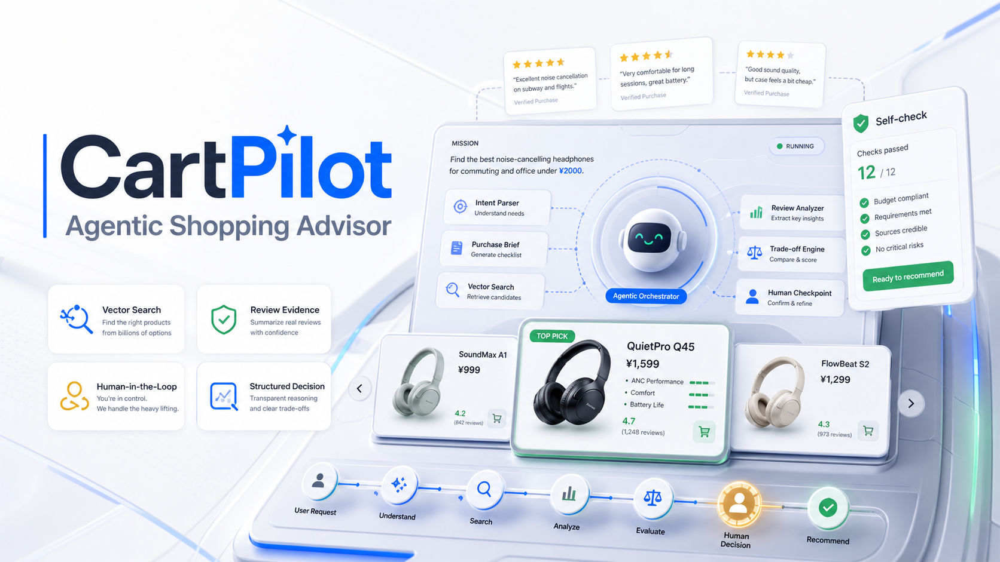
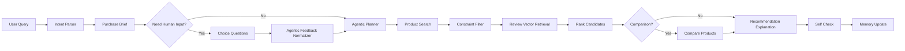

# CartPilot



**CartPilot** is a bounded agentic shopping advisor. It uses LangGraph to orchestrate a shopping decision workflow where an agent can ask follow-up questions, normalize user preferences, plan review retrieval, compare products, and generate evidence-grounded recommendations.

The project is designed as an interview-ready AI application: the LLM is allowed to make high-level decisions, while deterministic code still enforces budgets, hard exclusions, product facts, and self-checks.

## Highlights

- **Agentic purchase brief**: turns a natural-language shopping request into a structured task card.
- **Human-in-the-loop guide**: asks dynamic choice-based follow-up questions before recommendation.
- **Event-driven shopping copilot**: a side-assistant mode consumes shopping events such as search, product view, review view, compare, cart, and checkout to provide real-time guidance.
- **Bounded agent planning**: with `use_llm=true`, the agent can plan questions, tool flow, RAG queries, and recommendation explanations.
- **Chroma-backed retrieval**: product and review evidence retrieval default to persistent Chroma collections, with SQLite fallback for dependency-light local runs.
- **Embedding-ready vector stores**: product and review retrieval use pluggable embedding providers; local hash embeddings work offline, and OpenAI-compatible embeddings can be enabled through env vars.
- **Reranking and monitoring**: second-pass rerankers refine product/review ordering, while SQLite-backed run traces expose fallback, error, and self-check metrics.
- **Deterministic guardrails**: budget filters, excluded specs, product facts, and self-check are handled by code.
- **Session recovery**: Human-in-the-loop checkpoints and follow-up questions are persisted by session.
- **Multi-category support**: headphones, laptops, tablets, phones, monitors, projectors, coffee machines, and air fryers.
- **Productized demo UI**: Streamlit interface for purchase brief, requirement confirmation, recommendations, evidence, and debug trace.

## Why This Project

Most shopping assistants are either fixed recommendation systems or generic chatbots. CartPilot sits in the middle:

- The **agent** decides what to ask, what evidence to retrieve, whether to compare, and how to explain.
- The **tools** execute search, filtering, retrieval, ranking, comparison, and self-check.
- The **guardrails** prevent the model from overriding user constraints or inventing product facts.

This makes the project a good resume piece for discussing agent architecture, RAG, Human-in-the-loop UX, structured LLM output, and production safety boundaries.

## Architecture



## Agent Responsibilities

When LLM mode is enabled, CartPilot gives the agent six bounded responsibilities:

1. Generate dynamic follow-up questions.
2. Generate choice options based on the category profile.
3. Normalize Human-in-the-loop answers into structured constraints.
4. Plan review retrieval aspects and multi-query RAG prompts.
5. Plan the tool path, including comparison vs recommendation.
6. Rewrite recommendation explanations using only provided product facts and review evidence.

The agent does **not** directly enforce hard constraints. These remain deterministic:

- Budget limit
- User excluded specs or products
- Product price and specs
- Final self-check

## Tech Stack

- Python
- LangGraph
- FastAPI
- Streamlit
- Chroma vector store with SQLite fallback
- OpenAI-compatible Chat Completions API
- `unittest` test suite

## Project Structure

```text
backend/
  agents/              LangGraph workflow, agentic planner, state, purchase brief
  api/                 FastAPI entrypoint
  data/                Sample category profiles, products, reviews, category skills
  evaluation/          Small evaluation set and runner
  llm/                 OpenAI-compatible LLM client and intent parser
  memory/              In-memory user preference store
  retrieval/           Category retrieval, Chroma/SQLite vector stores
  tools/               Search, filter, rank, compare, recommend, self-check tools
frontend/
  streamlit_app.py     Productized demo UI
  copilot_app.py       Event-driven side-assistant demo
scripts/
  run_demo.py          CLI demo
  build_review_index.py
  test_llm.py
tests/
  Unit tests for workflow, retrieval, guardrails, evaluation, agentic planner
docs/
  project_design.md    Design notes
assets/
  cartpilot-poster.png
```

## Quick Start

Create and activate a virtual environment:

```bash
python3 -m venv .venv
source .venv/bin/activate
```

Install dependencies:

```bash
pip install -r requirements.txt
```

Run the CLI demo:

```bash
python3 scripts/run_demo.py
```

Run with a custom query:

```bash
python3 scripts/run_demo.py "预算2000以内，通勤和办公室用，想买降噪耳机，不要入耳式，戴久不要太累"
```

Run the Streamlit demo:

```bash
streamlit run frontend/streamlit_app.py
```

Run the event-driven copilot demo:

```bash
streamlit run frontend/copilot_app.py
```

Run the API server:

```bash
uvicorn backend.api.app:app --reload
```

Example API call:

```bash
curl -X POST http://127.0.0.1:8000/chat \
  -H "Content-Type: application/json" \
  -d '{
    "query": "预算2000以内，通勤和办公室用，想买降噪耳机，不要入耳式",
    "require_confirmation": true,
    "use_llm": false
  }'
```

Event-driven copilot event API:

```bash
curl -X POST http://127.0.0.1:8000/shopping/events \
  -H "Content-Type: application/json" \
  -d '{
    "session_id": "demo-shopping-session",
    "user_id": "demo-user",
    "event_type": "product_viewed",
    "payload": {"product_id": "H004"}
  }'
```

## LLM Configuration

CartPilot works without an API key by using deterministic fallback logic. To enable agentic planning, configure an OpenAI-compatible API.

Option 1: local config file:

```bash
cp llm.example.json llm.local.json
```

Then edit `llm.local.json`:

```json
{
  "base_url": "https://api.openai.com/v1",
  "api_key": "your-api-key",
  "model": "gpt-4o-mini",
  "timeout_seconds": 30
}
```

Option 2: environment variables:

```bash
export LLM_API_KEY="your-api-key"
export LLM_BASE_URL="https://api.openai.com/v1"
export LLM_MODEL="gpt-4o-mini"
```

`llm.local.json` and `.env` are ignored by git. Do not commit secrets.

## Vector Store Configuration

CartPilot defaults to Chroma for product and review vector retrieval:

```bash
export VECTOR_STORE_PROVIDER="chroma"
```

If `chromadb` is not installed, the app falls back to the lightweight SQLite vector store. To require Chroma and fail fast when it is missing:

```bash
export VECTOR_STORE_STRICT=true
```

Embedding defaults to local deterministic hash vectors. To use an OpenAI-compatible embedding model:

```bash
export EMBEDDING_PROVIDER="openai"
export EMBEDDING_BASE_URL="https://api.openai.com/v1"
export EMBEDDING_API_KEY="your-api-key"
export EMBEDDING_MODEL="text-embedding-3-small"
```

## Human-in-the-loop Flow

1. User submits a shopping request.
2. CartPilot builds a purchase brief.
3. The agent generates concise choice questions.
4. User answers by selecting options and optionally adding notes.
5. The answer is normalized into structured constraints.
6. Tools retrieve products, filter constraints, fetch review evidence, rank candidates, and self-check.

This keeps the user experience close to a real shopping guide instead of exposing raw JSON or internal traces.

## Evaluation and Tests

Run all tests:

```bash
python3 -m unittest discover -s tests
```

Run the small evaluation set:

```bash
python3 backend/evaluation/eval_agent.py
```

Build the review vector index:

```bash
python3 scripts/build_review_index.py
```

Run syntax checks:

```bash
python3 -m compileall backend frontend scripts tests
```

Current test coverage includes:

- Agent workflow trace and self-check
- Event-driven shopping copilot sessions
- Unknown category clarification
- Human-in-the-loop confirmation
- User feedback normalization
- Preference weighting
- Product comparison
- Review vector retrieval
- Small evaluation cases
- Agentic planner behavior with mocked LLM output

## Interview Talking Points

- **Bounded autonomy**: the model plans and explains, but tools enforce facts and constraints.
- **Agentic RAG**: the agent decides what review evidence to search for instead of using a fixed query.
- **Human-in-the-loop UX**: the interface asks choice questions before recommending products.
- **Fallback design**: the app runs without LLM access, then becomes more agentic when `use_llm` is enabled.
- **Observability**: trace and raw JSON are available in a debug panel, not shown to normal users.
- **Extensibility**: adding a category mainly requires a category profile, skill pack, products, and reviews.

## Roadmap

- Add a managed Chroma/Qdrant/Milvus deployment for larger product and review corpora.
- Add more real product and review data.
- Add LangGraph checkpoint or interrupt for resumable Human-in-the-loop sessions.
- Add reranking for product search and review retrieval.
- Expand the evaluation set to 20-30 high-quality shopping cases.

## License

This repository is intended for portfolio and interview demonstration. Add a formal license before public reuse.
